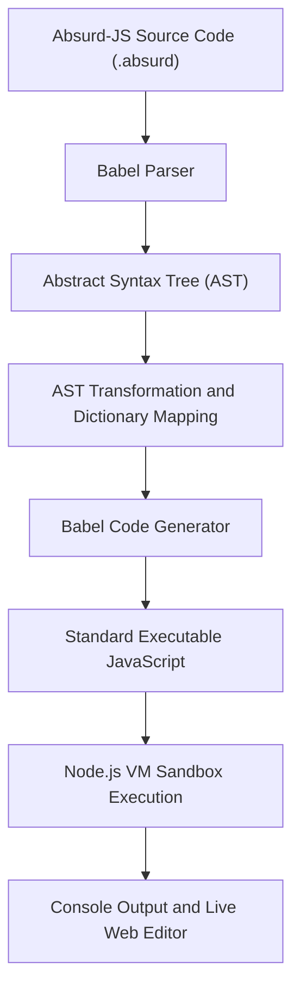

# Scubacode (Absurd-JS) 


## Basic Details

### Team Name: Asterisk

### Team Members
- Team Lead: Akhil Raj R - College of Engineering, Alappuzha
- Member 2: Christo Nevin - College of Engineering, Alappuzha

### Project Description
Scubacode (Absurd-JS) is a full-featured, source-to-source transpiler and interactive Web IDE for a custom Gen-Z slang programming language (`.absurd`). 

By leveraging Babel's Abstract Syntax Tree (AST) suite, Scubacode parses brainrot syntax, restructures identifier nodes, and compiles it down to fully executable JavaScript. It features bi-directional conversion (JavaScript ↔ Absurd-JS), isolated sandbox execution, and hilarious custom error roasts when your code fails the vibe check.

### The Problem (that doesn't exist)
Traditional programming languages are strictly stuck in the past with corporate, uninspired keywords like `const`, `let`, `if`, `else`, and `console.log()`. 

Writing code with these outdated keywords causes severe aura loss, drains dev energy, and completely fails the vibe check for Gen-Z software engineers.

### The Solution (that nobody asked for)
We built **Scubacode**, an unnecessarily dramatic and chaotic Web IDE and compiler that brings internet slang straight to language engineering. 

Now you can write full software programs using peak brainrot keywords:

- `frfr` instead of `const`
- `lowkey` instead of `let`
- `vibeCheck` instead of `if`
- `otherwise` instead of `else`
- `noCap` / `cap` instead of `true` / `false`
- `itsGiving` instead of `return`
- `deadass` instead of `function`
- `spill()` instead of `console.log()`
- `fanumtax` instead of `+=`
- `skibidi` instead of `-=`
- `mogged` instead of `>`

The AST engine transforms your slang into standard JavaScript, runs it safely in a sandbox environment, and serves custom roast messages if your syntax strays out of line!

---

## Technical Details

### Technologies/Components Used

#### For Software
- **Languages:** JavaScript (ES6+), HTML5, CSS3
- **Runtime Environment:** Node.js (v18+)
- **Backend Framework:** Express.js
- **Compiler / AST Tools:**
  - `@babel/parser` (Syntax parsing & AST generation)
  - `@babel/traverse` (AST node traversal & keyword substitution)
  - `@babel/generator` (Target JavaScript code generation)
  - `@babel/types` (AST type assertions & node construction)
- **Execution Sandbox:** Node.js `vm` module
- **Tools & Ecosystem:** npm, pnpm, Git, GitHub, VS Code

#### For Hardware
- Not applicable (Scubacode is a software-only project).

---

## Implementation

### Installation

```bash
# Clone the repository
git clone https://github.com/Syyrrex/Scubacode.git

# Navigate to the transpiler core directory
cd Scubacode/absurd-transpiler

# Install required Babel and server dependencies
npm install
```

### Run

**Start the Interactive Web IDE & Backend Server:**
```bash
node server.js
```
*Access the Web IDE in your browser at `http://localhost:3000`.*

**Run CLI Transpiler on `.absurd` Source Files:**
```bash
# Run logic & control flow example
node run.js examples/logic.absurd

# Run the classic FizzBuzz example in Absurd-JS
node run.js examples/fizzbuzz.absurd
```

**Run Automated Test Suite:**
```bash
npm test
```

---

## Project Documentation

### Screenshots


*Interactive Web IDE showing live Absurd-JS code entry, real-time JavaScript compilation, and output streaming.*


*Bi-directional JavaScript to Absurd-JS transpilation and live console output execution.*


*Custom error handler catching syntax bugs and returning slang roasts like "Skill issue detected on line X".*


### Diagrams

#### Workflow Architecture




## Project Demo

### Video
[Watch the Scubacode Demo Video](https://youtube.com/watch?v=your-demo-video-id)

*Demonstrates writing Absurd-JS programs, instant bi-directional conversion, running code in the browser sandbox, and triggering custom syntax roasts.*


## Team Contributions

- **Akhil Raj R :** Designed and built the entire Web IDE UI/UX frontend, output console, and styling. Collaborated on backend logic, AST transpilation modules, and sandbox integration.
- **Christo Nevin :** Lead architect for the backend system, dictionary mapping schemas, Babel AST parser/generator, reverse transpilation engine, Express server endpoints, and CLI runner.

---

Made with ❤️ at TinkerHub Useless Projects


